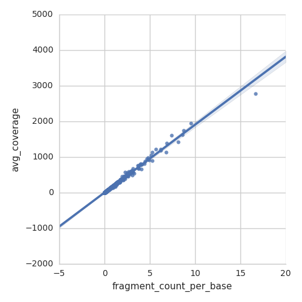

For those who prefer to skip the details, read directly the [Usage](#usage) and the [Examples](#examples) sections.


## Description

Roesti is a pipeline to analyze RNA-seq data from RNA-seq and Ribo-seq (ribosome profiling) experiments. It is written in Python 3.5 and uses the [Ruffus](http://www.ruffus.org.uk/) package to allow for automatic and flexible management of pipeline tasks that can be run in parallel on a cluster or on a local machine. All resources requirements for the job scheduler, as memory and wall time, are automatically adjusted. The pipeline tasks can be described as follows:

+ **Input**: fastq files.
+ Build indexed reference genome for bowtie2.
+ Trim low quality bases and adapter sequence from read ends, using either [SeqPurge](https://github.com/imgag/ngs-bits/blob/master/doc/tools/SeqPurge.md) ^[@Sturm2016] for paired-end reads or [skewer](https://sourceforge.net/projects/skewer/) ^[@Jiang2014] for single-end reads.
+ Align reads to the reference genome using [bowtie2](http://bowtie-bio.sourceforge.net/bowtie2) ^[@Langmead2012].
+ Convert alignment files SAM to sorted BAM using [samtools](http://www.htslib.org/) ^[@Li2009a].
+ Filter alignments by quality and size and report statistics, detect plus strand based on reads in ribosomal RNA region. Uses [BEDtools](http://bedtools.readthedocs.io/en/latest/index.html) ^[@Quinlan2010], samtools and GNU coreutils sort.
+ Convert BAM files to BEDPE file (BED with paired-end information with two read mates in the same record) or directly to BED file.
+ Extract ribosome footprints inserts by size (only in the case of Ribo-seq). Uses samtools and BEDtools.
+ **Output**: compute genome coverage (pile-up), per CDS measures: fragment count, average coverage, RPKM and TPM. All measures are normalized both with or without rRNA counts.


## Usage

In a terminal window (or putty on windows), first log in the CRG cluster by ssh,
```bash
ssh user1@ant-login.linux.crg.es
```
Load the dependencies (python3 and others) needed for the pipeline,
```bash
source /users/lserrano/mweber/Research_cloud/RNA-seq_data_analysis/src/load_dependencies.sh
```
You should now be in the python3 virtual environment, as indicated by the login prompt:
```
(python351) [user1@ant-login8 ~]$
```
Enter directory where you would like to write the output files (note that the fastq input files will not be modified),
```bash
cd /users/lserrano/user1/output
```
The description of the pipeline options can be printed with
```bash
pipeline_roesti --help
```
The default options are valid for *Mycoplasma pneumoniae* paired-end RNA-seq. First run a small test (takes only the first 25k reads),
```bash
pipeline_roesti -i /users/lserrano/sequencing_data/example_path/sampleA*.fastq.gz /users/lserrano/sequencing_data/example_path/sampleB*.fastq.gz --test --run-locally
```
Output files will be written in the current directory in the folder `pipeline_roesti`.

If no error appears, run the full pipeline,
```bash
pipeline_roesti -i /users/lserrano/sequencing_data/example_path/sampleA*.fastq.gz /users/lserrano/sequencing_data/example_path/sampleB*.fastq.gz
```
Do not close the terminal window till the end. The pipeline may take between 2 and 5 hours to complete, computing all the samples in parallel.


### Input

Any list of fastq files can be passed as input to the pipeline with the option `-i` or `--fastq-files`. Both compressed and uncompressed files are accepted. Wildcards such as ? * and [] can be used.

By default, the pipeline chooses the reference genome of Mycoplasma pneumoniae M129 (NC_000912.1) with the list of CDS updated from the last annotations table. In order to run the pipeline for a different organism, we need to specifiy several files. We can either

1. Create indexed reference genome sequence from fasta/genbank files. Or,
2. Use existing indexed reference genome and rRNA, genome, CDS files.


#### Creating indexed reference genome from fasta/genbank files

The genome can be indexed at the beginning of the pipeline run. Any collection of files in either genbank or fasta format (or a mix) can be used to define the set of reference DNA sequences for the alignment of the reads.

+ `--ref-genbank`       List of filenames for reference DNA sequences in Genbank format. Wildcards such as ? * and [] can be used. Annotations in genbank format will be used to create the CDS and rRNA BED files.
+ `--ref-fasta`         List of filenames for reference DNA sequences in fasta format. Wildcards such as ? * and [] can be used.
+ `--ref-output-name`   Base name of the indexed genome and BED files.  By default, the base name is set to the concatenated id's found in the Genbank or fasta files.
+ `--ref-output-dir`    Directory of the indexed genome and BED files. By default, the indexed genome files will be written in the directory "./REF_OUTPUT_NAME".


#### Using existing indexed reference genome (optional)

If a reference genome has already been indexed with `bowtie2-build`, we can set the path to the indexed genome files and BED files for the CDS:

+ `--indexed-ref-genome` Path to the basename of the index for the reference genome.
+ `--rRNA-bedfile` Path to the BED file of rRNA regions. Reads aligning in the first rRNA region will be used to determine the strandness.
+ `--rRNA-tRNA-bedfile` Path to the BED file of rRNAs and tRNAs regions of the genome. If the option remove-rRNA is not set, this option does not need to be defined. If the option remove-rRNA is set, all reads aligning in these regions will be filtered out. **Warning**: In this case, please check that the correct definition for the organism of interest of rRNA regions is used. By default the rRNA and tRNA regions of *Mycoplasma pneumoniae* are used.
+ `--genome-bedfile`    Path to the BED file genome. Simple BED file that lists the names of the chromosomes (or scaffolds, etc.) and their size (in basepairs).
+ `--genome-CDS-bedfile` Path to the BED file for all CDS. Will be used to count mRNA fragments for each gene. If set to empty string \"\", the computation of fragment count per CDS will be skipped.

Some of the files are optional. The minimal files required to run the pipeline are:

+ `--indexed-ref-genome`
+ `--rRNA-bedfile`
+ `--genome-bedfile`


### Output

The directory for output files can be defined with the option `-o` or `--output-dir`, by default the current directory.

The main output files in the case of RNA-seq analysis are located in the subfolder `Task07_genome_coverage_fragment_count`:

+ `sample1.CDS_fragment_count.bed` RNA fragment count for each CDS.
+ `sample1.CDS_average_coverage.bed` average per-base coverage for each CDS.
+ `sample1.CDS_values.csv` all values for each CDS in a csv table. We compute twice all these values, filtering or not the rRNA reads.
    - fragment count
    - average coverage
    - RPKM
    - RPKM no rRNA
    - TPM (based on fragment count)
    - TPM (based on fragment count) no rRNA
    - TPM (based on average coverage)
    - TPM (based on average coverage) no rRNA
+ `sample1.strandp_coverage.bed` per-base coverage over the genome (also called pile-up) for the plus strand.
+ `sample1.strandm_coverage.bed` per-base coverage over the genome (also called pile-up) for the minus strand.

All these files are in [BED format](http://www.ensembl.org/info/website/upload/bed.html) and in CSV format.


#### Interpretation of output

Both fragment counts and average per-base coverage can be interpreted as the level of mRNA molecules present in the sample. In theory, if fragment size distribution is the same for every transcript, the number of fragments should be perfectly proportional to the number of transcripts. However, this might not be true if fragments are smaller for a specific transcript, therefore artificially increasing the number of fragments for this transcript compared to the others. Averaging the per-base coverage eliminates the dependency on fragment size.

{width=50%}


#### Normalization

Only *within-sample* normalization are provided. We compute the following normalized counts/levels at CDS-level. We compute both with and without rRNA reads.

See also: [What the FPKM? A review of RNA-Seq expression units | The farrago](https://haroldpimentel.wordpress.com/2014/05/08/what-the-fpkm-a-review-rna-seq-expression-units/)

##### FPKM (or RPKM)

Fragments per kilobase of exon per million (FPKM) (for paired-end reads), or reads per kilobase of exon per million (RPKM) (for single-end reads) are essentially the same and normalize the read count for CDS $i$ by the length of the CDS in kilobases $l_i$ and by the total number of reads $N$ (sequencing depth). Note that by read we really mean one fragment of RNA that could either yield one single-end read, or one pair of paired-end reads.

\begin{align}
\text{FPKM}_i = \frac{X_i}{ \left( \frac{l_i}{10^3} \frac{N}{10^6} \right) }
\end{align}

##### TPM

Transcripts per million (TPM) is a measurement of the proportion of transcripts in your pool of RNA. It is given by the rate of fragment count per base $X_i/l_i$, normalized by the sum of all the rates for all CDS/transcripts. We scale it by one million to obtain numbers more convenient to work with.

\begin{align}
\text{TPM}_i = \frac{X_i}{l_i} \frac{1}{\sum_j \frac{X_i}{l_i} } 10^6
\end{align}


### Run the computation on the cluster

When running the pipeline by the command line, the ssh session in the terminal needs to remain open in order for the pipeline to run. In the case that the terminal windows gets closed or the connection to the cluster interrupted, the pipeline will stop. In you wish to keep the pipeline running on the cluster in these cases, you can detach the pipeline command from the current login session, usin the nohup command together with the ampersand symbol at the end of the command line. Example:
```bash
nohup pipeline_roesti -i /pathto/ecoli_fastafiles/*.fastq.gz 1> roesti.out 2> roesti.err &
```
This way, the computation will run in the background and will not be killed when closing the terminal session or logging out. Information on the status of the computation can be found in the redirected output and error of the command.
```bash
less roesti.out
less roesti.err
```
and also in the log file of the pipeline,
```bash
less pipeline_roesti/pipeline_roesti.log
```
Current jobs that are running or pending can be listed with the `qstat` command.


### Kill a running job

If the pipeline was executed in the current session without nohup, first kill the process by pressing `ctrl+c`, and then kill the jobs that entered the cluster queue. To list the pending and running jobs, use the command
```bash
qstat
```
You can kill all jobs for user `user1` with the command
```bash
qdel -u user1
```

If the pipeline was executed in the background with nohup, you first have to kill the python process. The simplest way to do that is to kill all processes that have python3 as a name. If you have other python processes running on the same login node, this will kill all of them,
```bash
pkill python3
```
and then, kill all the jobs running on the cluster,
```bash
qdel -u user1
```


### Resume or re-run pipeline tasks

Because the pipeline is using the [Ruffus](http://www.ruffus.org.uk/) framework, it is possible to resume the computation at a specific task. By default, you can re-launch the pipeline and it will resume from the last incomplete task. If you want to re-run a specific task, just *delete the output files* or the *directory* "TaskXX" and re-run the pipeline. The pipeline will resume the computation at the step where the output files are missing. If you want to re-run the full pipeline, delete all the output files and re-run the pipeline.


# Examples

### Example: RNA-seq for Mycoplasma pneumoniae

By default, the pipeline chooses the reference genome of Mycoplasma pneumoniae M129 (NC_000912.1) with the list of CDS updated from the last annotations table. We can run the analysis pipeline with no other options,
```bash
nohup pipeline_roesti -i /users/lserrano/sequencing_data/example_path/*.fastq.gz &
```


### Example: RNA-seq for Mycoplasma pneumoniae with an additional DNA construct

In this case, we have to give as input the Genbank or fasta files for the reference genome and for the construct. An updated version of the reference genome of Mycoplasma_pneumoniae M129 with the latest annotations in Genbank flat file format can be found at the following path:
```bash
/users/lserrano/mweber/Research_cloud/Mycoplasma_pneumoniae_experimental_data/Annotation/NC_000912.1_updated_annotations.gbff
```
This Genbank file was created from the following information sources:

- annotation table from file "Table annotation_latest.xlsx", march 2016.
- all variants as detected from sequenced genome  of 2009 of the lab strain of Mycoplasma pneumonia M129.
- protein sequences and RefSeq accession number retrieved from NCBI Entrez RefSeq genome sequence and annotations (assembly GCF_000027345.1 and genome sequence RefSeq NC_000912.1).
- essentiality study 2016 by Maria and Samuel with the Poisson method.

In addition, we need the DNA sequence of the construct, which can be either in Genbank or fasta format. The DNA sequence files will be automatically parsed, indexed for the bowtie2 aligner and the list of CDS from Genbank annotations extracted. If the construct sequence is in Genbank format, we can list both files (whitespace separated) after the option `--ref-genbank`,
```bash
nohup pipeline_roesti -i /users/lserrano/sequencing_data/example_path/*.fastq.gz \
    --ref-genbank /users/lserrano/mweber/Research_cloud/Mycoplasma_pneumoniae_experimental_data/Annotation/NC_000912.1_updated_annotations.gbff \
    /pathto/construct_plasmid.gb &
```
If the construct sequence is in fasta format, we use the option `--ref-fasta`,
```bash
nohup pipeline_roesti -i /users/lserrano/sequencing_data/example_path/*.fastq.gz \
    --ref-genbank /users/lserrano/mweber/Research_cloud/Mycoplasma_pneumoniae_experimental_data/Annotation/NC_000912.1_updated_annotations.gbff \
    --ref-fasta /pathto/construct_plasmid.fna &
```


### Example: RNA-seq for other organisms

We give as input the fastq files and the reference genome in genbank format. The DNA sequence files will be automatically parsed, indexed for the bowtie2 aligner and the list of CDS from Genbank annotations extracted.
```bash
nohup pipeline_roesti -i /pathto/*.fastq* \
	--ref-genbank /pathto/ecoli_K12_MG1655_NC_000913.3.gb \
	--ref-fasta /pathto/plasmid1.fasta &
```


### Examples of genome, CDS and rRNA BED files (optional)

The genome BED file is simply a list of all chromosomes and their length in number of bases. Example for E. coli:
```
NC_000913.3     4641652
```
or
```
NC_000913.3     4641652
plasmid1	5634
```

The genome CDS BED file is a list of all CDS in BED format. Note that BED format uses 0-based start-inclusive end-exclusive counting (as in Python). Records are tab-delimited. The header usually has the following format:
```
chromosome_name, start position of the feature, end position of the feature, name, score, strand
```
Example for E. coli:
```
NC_000913.3     189     255     thrL    0       +
NC_000913.3     336     2799    thrA    0       +
NC_000913.3     2800    3733    thrB    0       +
NC_000913.3     3733    5020    thrC    0       +
NC_000913.3     5233    5530    yaaX    0       +
NC_000913.3     5682    6459    yaaA    0       -
NC_000913.3     6528    7959    yaaJ    0       -
NC_000913.3     8237    9191    talB    0       +
NC_000913.3     9305    9893    mog     0       +
NC_000913.3     9927    10494   satP    0       -
...
```

The rRNA and rRNA-tRNA BED files are defining the corresponding genomic regions, in BED format. Example for E. coli:
```
NC_000913.3     223770  225312  rrsH    0       +
NC_000913.3     225758  228662  rrlH    0       +
NC_000913.3     228755  228875  rrfH    0       +
NC_000913.3     2726068 2726188 rrfG    0       -
NC_000913.3     2726280 2729184 rrlG    0       -
...
```


### Example using existing indexed genome files (optional)

As an example, files were prepared for aligning reads to the strain Escherichia coli K12_MG1655. The pipeline can be run by defining the path for all genome files corresponding to the organism. We included the command in a bash script for easier handling. The `--pipeline-name` option is used to create different output directories to differentiate the results for paired-end fastq files to the results for single-end fastq files when these are mixed in the same batch of samples.
```bash
#!/bin/bash

GENOME_PATH="/users/lserrano/mweber/Translation_model/Ribosome_profiling_data/bowtie2_indexed_genome/Ecoli"
GENOME_NAME="ecoli_K12_MG1655_NC_000913.3"

nohup pipeline_roesti \
    --fastq-files /pathto/ecoli_fastafiles/*.fastq.gz \
    --indexed-ref-genome "${GENOME_PATH}/${GENOME_NAME}" \
    --rRNA-bedfile "${GENOME_PATH}/${GENOME_NAME}_rRNA.bed" \
    --genome-bedfile "${GENOME_PATH}/${GENOME_NAME}.genome" \
    --genome-CDS-bedfile "${GENOME_PATH}/${GENOME_NAME}_CDS.bed" \
    --seq-end paired-end \
    --library-type rna-seq \
    1> roesti_PE.out 2> roesti_PE.err &
```


## Dependencies

+ Python 3.5 with modules:
    + ruffus 2.63
    + pandas 0.18.1
    + numpy 1.11.1
    + matplotlib 1.5.1
    + seaborn 0.7.1
+ DRMAA library
+ SeqPurge 0.1-478-g3c8651b (part of NGS-bits software suite)
+ Qt 5.5 for NGS-bits (maybe we could get rid of this dependency)
+ bowtie2 2.2.9
+ samtools 1.3.1
+ BedTools 2.26


## Troubleshooting

### Jobs stuck waiting in the queue

The alignment task uses by default 12 threads. When the cluster usage is very high, the alignement jobs can remain a long time waiting in queue. Try to re-launch the pipeline with a smaller amount of threads, for example `--nthreads 8`.

### Syntax error

```
The stderr was: 
    [b"/software/as/el6.5/modules/Modules/3.2.10/init/bash_completion: line 14: syntax error near unexpected token `('\n", b"/software/as/el6.5/modules/Modules/3.2.10/init/bash_completion: line 14: `\tcomm -23  <(_module_avail|sort)  <(tr : '\\n' <<<${LOADEDMODULES}|sort)'\n"]
```
This error is caused by an incompatibility between the Bash commandline completion for Modules 3.2.10 located at
 `${MODULESHOME}/init/bash_completion` and the python subprocess module. The module library has been updated on the cluster in the new Scientific Linux v7. Please update your `~/.bashrc` file as follows:

 Remove or comment out line
```bash
source /software/as/el6.5/modules/Modules/3.2.10/init/bash
```
and replace it by
```bash
module use /software/as/el7.2/EasyBuild/CRG/modules/all
```


## Description of options

```
usage: pipeline_roesti [-h] [--verbose [VERBOSE]] [--version] [-L FILE]
                       [-T JOBNAME] [-j N] [--use_threads] [-n]
                       [--touch_files_only] [--recreate_database]
                       [--checksum_file_name FILE] [--flowchart FILE]
                       [--key_legend_in_graph] [--draw_graph_horizontally]
                       [--flowchart_format FORMAT] [--forced_tasks JOBNAME]
                       [-g REFGENBANK [REFGENBANK ...]]
                       [-f REFFASTA [REFFASTA ...]]
                       [--ref-output-name REFOUTPUTNAME]
                       [--ref-output-dir REFOUTPUTDIR]
                       [-i INPUT_FASTQ_FILES [INPUT_FASTQ_FILES ...]]
                       [-o OUTPUT_DIR] [--test] [--run-locally]
                       [--pipeline-name PIPELINE_NAME]
                       [--library-type {ribo-seq,rna-seq}]
                       [--seq-end {single-end,paired-end}]
                       [--adapter-seq-fw TRIM_ADAPTER_SEQ_FORWARD]
                       [--adapter-seq-rv TRIM_ADAPTER_SEQ_REVERSE]
                       [--remove-rRNA]
                       [--align-quality-threshold FILTER_ALIGNMENTS_QUALITY_THRESHOLD]
                       [--indexed-ref-genome ALIGN_INDEXED_REF_GENOME_PATH]
                       [--rRNA-bedfile RRNA_BEDFILE]
                       [--rRNA-tRNA-bedfile RRNA_TRNA_BEDFILE]
                       [--genome-bedfile GENOMEBEDFILE]
                       [--genome-CDS-bedfile GENOMECDSBEDFILE]
                       [--nthreads NTHREADS] [--njobsmax NJOBS]
                       [--bash-profile BASH_PROFILE] [--jobid JOBID]

pipeline_roesti Pipeline to analyze RNA-seq data from RNA-seq and Ribo-seq
(ribosome profiling) experiments. Python 3.5 script. | Author: Marc Weber |
Last updated: 2017.02.14 | Affiliation: Center for Genomic Regulation, Luis
Serrano's lab | email: webermarcolivier@gmail.com | Remark: we refer to insert
as the original RNA fragment flanked by adapters and read by sequencing (as
opposed to "insert" as the inner interval between two paired reads).

optional arguments:
  -h, --help            show this help message and exit
  -g REFGENBANK [REFGENBANK ...], --ref-genbank REFGENBANK [REFGENBANK ...]
                        List of filenames for reference DNA sequences in
                        Genbank format. Wildcards such as ? * and [] can be
                        used. Annotations in genbank format will be used to
                        create the CDS and rRNA BED files. (default: None)
  -f REFFASTA [REFFASTA ...], --ref-fasta REFFASTA [REFFASTA ...]
                        List of filenames for reference DNA sequences in fasta
                        format. Wildcards such as ? * and [] can be used.
                        (default: None)
  --ref-output-name REFOUTPUTNAME
                        Base name of the indexed genome and BED files. By
                        default, the base name is set to the concatenated id's
                        found in the Genbank or fasta files. (default: None)
  --ref-output-dir REFOUTPUTDIR
                        Directory of the indexed genome and BED files.
                        (default: .)
  -i INPUT_FASTQ_FILES [INPUT_FASTQ_FILES ...], --fastq-files INPUT_FASTQ_FILES [INPUT_FASTQ_FILES ...]
                        List of input fastq files separated by white spaces.
                        Wildcards such as ? * and [] can be used. (default:
                        ['*.fastq*'])
  -o OUTPUT_DIR, --output-dir OUTPUT_DIR
                        Output directory. (default: .)
  --test                Run a test by taking as input the first 25k reads of
                        the first fasta file. (default: False)
  --run-locally         Run the pipeline on local machine (as opposed to
                        submitting jobs to the cluster). Note that multiple
                        threads could be used. (default: False)
  --pipeline-name PIPELINE_NAME
                        Name of the pipeline. Results will be written in
                        "output-dir/pipeline-name". Important: the history of
                        up-to-date files is kept in a database of the same
                        name, .pipeline_roesti_2.ruffus_history.sqlite.
                        (default: pipeline_roesti)
  --library-type {ribo-seq,rna-seq}
                        Type of RNA-seq library. In ribosome profiling data
                        analysis, additional fragment filtering is applied in
                        order to select ribosome footprints. (default: rna-
                        seq)
  --seq-end {single-end,paired-end}
                        Single-end or paired-end sequencing data. (default:
                        paired-end)
  --adapter-seq-fw TRIM_ADAPTER_SEQ_FORWARD
                        Adapter sequence forward. Default will be set to
                        TruSeq Universal Adapter 5’ AGATCGGAAGAGCACACGTCT
                        (default: )
  --adapter-seq-rv TRIM_ADAPTER_SEQ_REVERSE
                        Adapter sequence reverse. Default will be set to
                        TruSeq Universal Adapter 5’ AGATCGGAAGAGCACACGTCT for
                        rna-seq library, and to Illumina RNA PCR Primer
                        GATCGTCGGACTGTAGAACTCTGAACGTGTAGATCTCGGTGGTCGCCGTA for
                        ribo-seq library. (default: )
  --remove-rRNA         Remove reads that align to the rRNA. (default: False)
  --align-quality-threshold FILTER_ALIGNMENTS_QUALITY_THRESHOLD
                        Filter out reads with alignment quality score MAPQ
                        smaller than the threshold. (default: 15)
  --indexed-ref-genome ALIGN_INDEXED_REF_GENOME_PATH
                        Path to the basename of the index for the reference
                        genome built with bowtie2-build. (default: /users/lser
                        rano/mweber/Ribosome_profiling_data/bowtie2_indexed_ge
                        nome/Mpn/NC_000912)
  --rRNA-bedfile RRNA_BEDFILE
                        Path to the BED file of rRNA regions. Reads aligning
                        in the first rRNA region will be used to determine the
                        strandness. (default: /users/lserrano/mweber/Research_
                        Dropbox/Mycoplasma_pneumoniae_experimental_data/Annota
                        tion/mpn_rRNA.bed)
  --rRNA-tRNA-bedfile RRNA_TRNA_BEDFILE
                        Path to the BED file of rRNAs and tRNAs regions of the
                        genome. If the option remove-rRNA is set, all reads
                        aligning in these regions will be filtered out.
                        (default: /users/lserrano/mweber/Research_cloud/Myco
                        plasma_pneumoniae_experimental_data/Annotation/mpn_rRN
                        A_tRNA.bed)
  --genome-bedfile GENOMEBEDFILE
                        Path to the BED file genome. Simple BED file that
                        lists the names of the chromosomes (or scaffolds,
                        etc.) and their size (in basepairs). (default: /users/
                        lserrano/mweber/Research_cloud/Mycoplasma_pneumoniae
                        _experimental_data/Genome/NC_000912.1.genome)
  --genome-CDS-bedfile GENOMECDSBEDFILE
                        Path to the BED file for all CDS. Will be used to
                        count mRNA fragments for each gene. If set to empty
                        string "", the computation of fragment count per CDS
                        will be skipped. (default: /users/lserrano/mweber/Rese
                        arch_Dropbox/Mycoplasma_pneumoniae_experimental_data/A
                        nnotation/mpn_CDS.bed)
  --nthreads NTHREADS   Number of threads to use in each cluster node (shared
                        memory). This will reduce computational time, in
                        particular for bowtie2 (alignment). (default: 12)
  --njobsmax NJOBS      Number of concurrent jobs to launch on the cluster
                        (each job will use nThreads nodes in shared memory).
                        (default: 200)
  --bash-profile BASH_PROFILE
                        Bash profile is executed before each job on the
                        cluster in order to load the dependencies. By default
                        bash profile path is automatically detected in user's
                        home directory, this option sets the path manually.
                        (default: )
  --jobid JOBID         Integer that identifies the overall pipeline run. It
                        is independent from the jobids of the job submissions.
                        (default: 0)

Common options:
  --verbose [VERBOSE], -v [VERBOSE]
                        Print more verbose messages for each additional
                        verbose level. (default: [])
  --version             show program's version number and exit
  -L FILE, --log_file FILE
                        Name and path of log file (default: None)

pipeline arguments:
  -T JOBNAME, --target_tasks JOBNAME
                        Target task(s) of pipeline. (default: [])
  -j N, --jobs N        Allow N jobs (commands) to run simultaneously.
                        (default: 1)
  --use_threads         Use multiple threads rather than processes. Needs
                        --jobs N with N > 1 (default: False)
  -n, --just_print      Don't actually run any commands; just print the
                        pipeline. (default: False)
  --touch_files_only    Don't actually run the pipeline; just 'touch' the
                        output for each task to make them appear up to date.
                        (default: False)
  --recreate_database   Don't actually run the pipeline; just recreate the
                        checksum database. (default: False)
  --checksum_file_name FILE
                        Path of the checksum file. (default: None)
  --flowchart FILE      Don't run any commands; just print pipeline as a
                        flowchart. (default: None)
  --key_legend_in_graph
                        Print out legend and key for dependency graph.
                        (default: False)
  --draw_graph_horizontally
                        Draw horizontal dependency graph. (default: False)
  --flowchart_format FORMAT
                        format of dependency graph file. Can be 'pdf', 'svg',
                        'svgz' (Structured Vector Graphics), 'pdf', 'png'
                        'jpg' (bitmap graphics) etc (default: None)
  --forced_tasks JOBNAME
                        Task(s) which will be included even if they are up to
                        date. (default: [])
```

# Bibliography